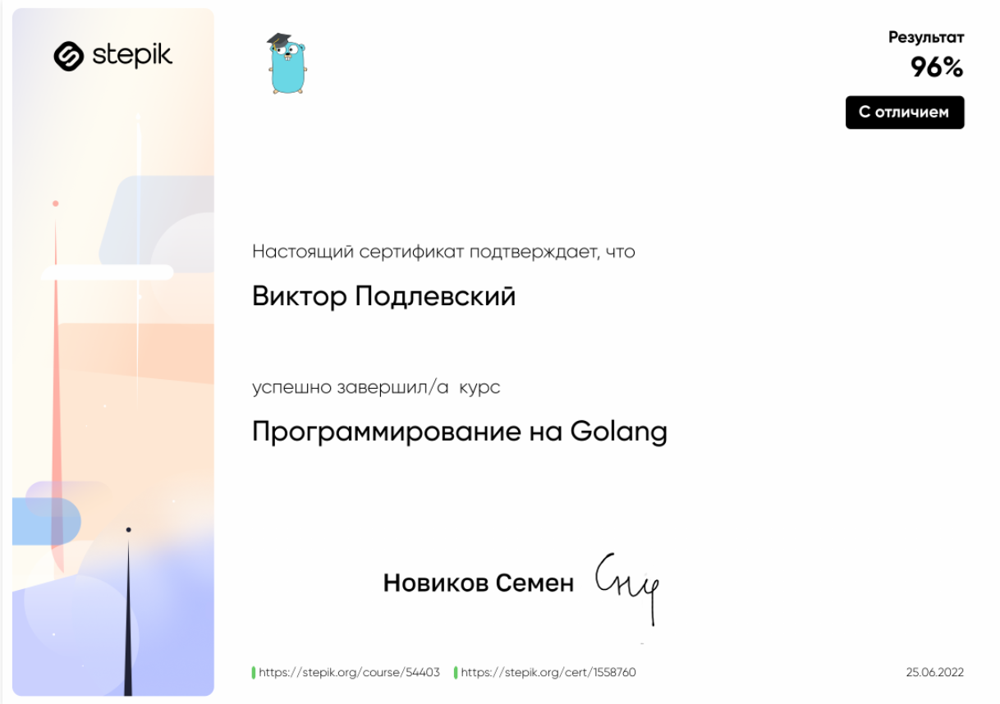

## Курс "Программирование на Golang"
В рамках данного курса я познакомился с основными возможностями языка Golang. Изучил:
- циклы;
- срезы;
- горутины;
- работу с JSON;
- и многое другое.

[Ссылка на курс](https://stepik.org/course/54403/info)
